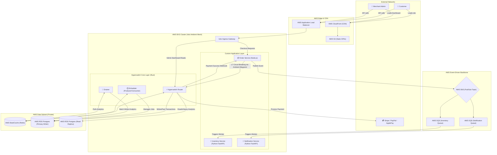

# Enterprise Payment & E-Commerce Architecture

This document represents the complete, production-grade, DevSecOps architecture for the Hyperswitch payment platform combined with custom e-commerce microservices. 

It is designed for **High Availability**, **Zero-Trust Security** (via Istio Ambient Mesh), and **Extreme Scalability** (via Event-Driven AWS Serverless components).

## System Architecture Diagram

---

## Architectural Breakdown

### 1. The Edge & Presentation Layer (AWS S3 + CloudFront)
Instead of serving HTML/JS from expensive compute nodes, all three frontends (`ecommerce-frontend`, `hyperswitch-control-center`, and `hyperswitch-web` SDK) are compiled as static files and placed in an **AWS S3 Bucket**. **CloudFront** caches them globally, giving users sub-50ms load times regardless of their physical location.

### 2. The Zero-Trust Network (Istio Ambient Mesh)
This is where the DevSecOps magic happens. Because we are handling credit cards (PCI-DSS compliance), we use Istio Ambient Mesh inside EKS:
*   **mTLS Everywhere:** The L4 `ztunnel` automatically encrypts all traffic between the Order Service, Router, and Redis without changing a single line of application code.
*   **Circuit Breaking:** The L7 `Waypoint Proxies` intercept the HTTP call between the `Order Service` and the `Hyperswitch Router`. If the Router gets overloaded, the mesh instantly trips the circuit breaker, protecting the rest of the cluster from cascading failures.

### 3. The Custom Application Layer (Polyglot Microservices)
We built three distinct microservices using the best languages for their respective jobs:
*   **Order Service (Node.js):** Best for handling highly concurrent HTTP requests from the customer's web browser.
*   **Inventory & Notification Services (Python):** Python (via FastAPI) is fantastic for data-processing and worker scripts. These services live purely to consume SQS messages.

### 4. The Event-Driven Backbone (AWS SNS + SQS)
To achieve massive scale (e.g., Black Friday traffic), we completely decoupled post-payment actions using the **Pub/Sub Pattern**:
*   When a payment succeeds, the Order Service publishes ONE message to an **SNS Topic**.
*   That topic instantly fans out the message to multiple **SQS Queues**.
*   This means if the Notification (Email) server crashes, it doesn't break the Inventory server. The email sits safely in the SQS Queue until the service comes back online.

### 5. The Data Layer (CQRS Pattern)
We implemented Command Query Responsibility Segregation (CQRS) on the databases:
*   **Primary Database:** Handles only fast `INSERT` commands for live checkouts.
*   **Read Replica:** When a merchant logs into the Control Center and asks for a 30-day revenue report, the Router pulls that data exclusively from the Replica, ensuring live customers never experience database lag.
