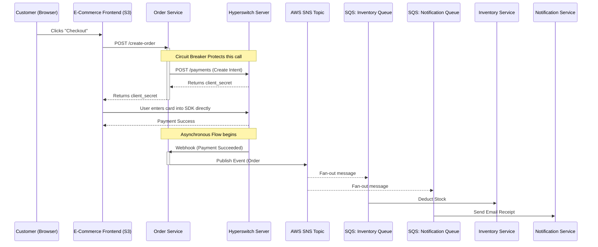

# Custom E-Commerce & Payment Architecture

This document outlines the production-grade architecture combining AWS services (S3, SNS, SQS), the Hyperswitch payment gateway, and custom microservices.

## 1. Frontends (Hosted on AWS S3 + CloudFront)
Instead of Docker containers, these static SPAs are hosted globally via CDN:
*   **`hyperswitch-control-center`**: The admin dashboard for merchants.
*   **`hyperswitch-web` (SDK)**: The hosted javascript SDK.
*   **`ecommerce-frontend` (NEW)**: Your custom storefront (React/Next.js) where customers actually shop. This app *embeds* the Hyperswitch Web SDK.

## 2. Core Payment Gateway (Hosted on EKS)
*   **`hyperswitch-server` (Router)**
*   **`hyperswitch-scheduler` (Producer/Consumer)**
*   **`hyperswitch-drainer`**

## 3. Custom Microservices (The "Big" Platform)
To build a robust system around the payment gateway, we use an **Event-Driven Architecture** with SNS/SQS.

### A. Order Service (Node.js)
*   **Role**: Handles the customer's cart and initiates checkout.
*   **Circuit Breaker Pattern**: When this service calls the `hyperswitch-server` API to create a payment, it uses a Circuit Breaker (e.g., `opossum` in Node.js). If Hyperswitch goes down, the circuit "opens" and returns a graceful error to the user immediately, preventing your Order Service from crashing due to hanging requests.
*   **SNS Publisher**: Once a payment is confirmed via Webhook, this service publishes a `PaymentSucceeded` event to an **AWS SNS Topic**.

### B. Inventory Service (Node.js/Python)
*   **Role**: Deducts items from the warehouse stock.
*   **SQS Consumer**: Subscribed to the SNS Topic via an **AWS SQS Queue** (`inventory-queue`). When a payment succeeds, it pulls the message from SQS and safely updates the stock database.

### C. Notification Service (Go/Node.js)
*   **Role**: Emails receipts to customers.
*   **SQS Consumer**: Subscribed to the same SNS Topic via its own **AWS SQS Queue** (`notification-queue`). It pulls the message and triggers AWS SES or SendGrid.

## Architecture Flow Diagram

